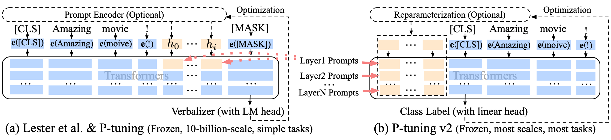
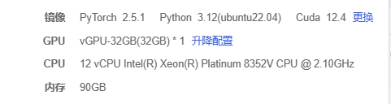

# p-tuning-v2-reproduce
Reproduce a prompt-learning method: P-Tuning V2, from the paper 《P-Tuning v2: Prompt Tuning Can Be Comparable to Fine-tuning Universally Across Scales and Tasks》

- This project is a reproduce from this repo: [P-Tuning V2](https://github.com/THUDM/P-tuning-v2/tree/main)
- but we do add some additional changes and additional models: `ChatGLM2`




## Environment Config
- AutoDL Cloud Platform
  


- then, make sure to pre-download the model weight (e.g. ChatGLM2-6B on the huggingface) to the local storage (e.g., `/root/autodl-tmp/models/chatglm2`).


## Citation
```bibtex
@article{DBLP:journals/corr/abs-2110-07602,
  author    = {Xiao Liu and
               Kaixuan Ji and
               Yicheng Fu and
               Zhengxiao Du and
               Zhilin Yang and
               Jie Tang},
  title     = {P-Tuning v2: Prompt Tuning Can Be Comparable to Fine-tuning Universally
               Across Scales and Tasks},
  journal   = {CoRR},
  volume    = {abs/2110.07602},
  year      = {2021},
  url       = {https://arxiv.org/abs/2110.07602},
  eprinttype = {arXiv},
  eprint    = {2110.07602},
  timestamp = {Fri, 22 Oct 2021 13:33:09 +0200},
  biburl    = {https://dblp.org/rec/journals/corr/abs-2110-07602.bib},
  bibsource = {dblp computer science bibliography, https://dblp.org}
}

```


