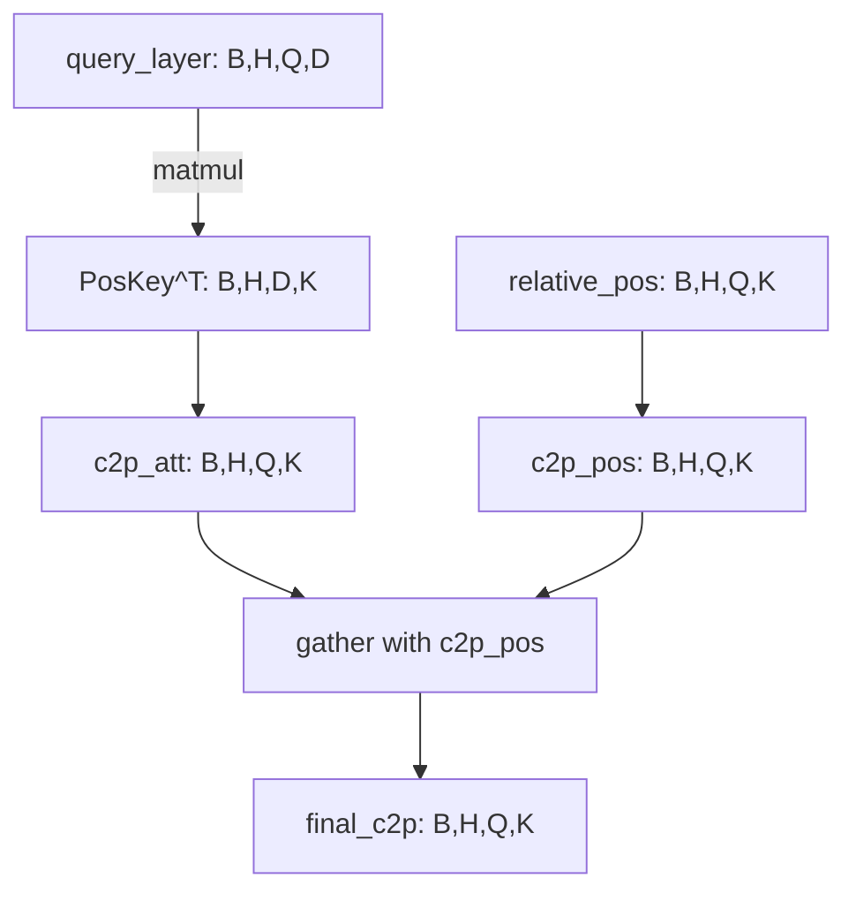
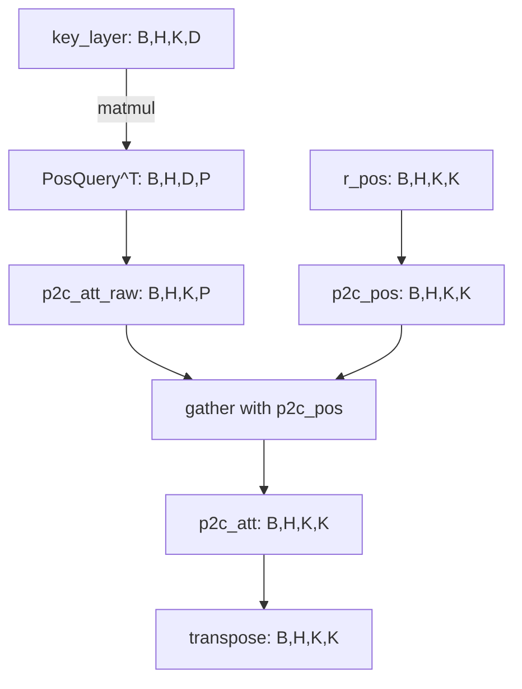

### 核心创新点
DeBERTa通过**解耦注意力机制**将内容和位置信息分开处理[^1](https://medium.com/dair-ai/papers-explained-08-deberta-a808d9b2c52d)，主要包含两个关键改进：

1. **内容-位置解耦**：每个token用两个向量表示
   - 内容向量：编码语义信息
   - 位置向量：编码相对位置信息

2. **增强的mask解码器**：显式建模token间的相对位置

### 代码结构解析
#### 1. 初始化部分 (`__init__`)
```python
class DisentangledSelfAttention(nn.Module):
    def __init__(self, config):
        # 参数校验
        if config.hidden_size % config.num_attention_heads != 0:
            raise ValueError(...)
        
        # 注意力头配置
        self.num_attention_heads = config.num_attention_heads
        self.attention_head_size = int(config.hidden_size / config.num_attention_heads)
        self.all_head_size = self.num_attention_heads * self.attention_head_size
        
        # 核心投影层（生成Q,K,V）
        self.in_proj = nn.Linear(config.hidden_size, self.all_head_size * 3, bias=False)
        
        # 偏置项创新点：仅对Q和V添加可学习偏置
        self.q_bias = nn.Parameter(torch.zeros((self.all_head_size), dtype=torch.float)) 
        self.v_bias = nn.Parameter(torch.zeros((self.all_head_size), dtype=torch.float))
        
        # 相对位置编码相关
        self.relative_attention = getattr(config, "relative_attention", False)
        self.pos_att_type = config.pos_att_type  # 位置注意力类型(c2p/p2c/p2p)
        
        if self.relative_attention:
            # 位置投影层
            self.pos_proj = nn.Linear(config.hidden_size, self.all_head_size, bias=False)
            self.pos_q_proj = nn.Linear(config.hidden_size, self.all_head_size)
```

#### 2. 前向传播 (`forward`)
```python
def forward(...):
    # 生成Q,K,V
    qp = self.in_proj(hidden_states)
    query_layer, key_layer, value_layer = self.transpose_for_scores(qp).chunk(3, dim=-1)
    
    # 添加解耦偏置
    query_layer += self.transpose_for_scores(self.q_bias[None, None, :])
    value_layer += self.transpose_for_scores(self.v_bias[None, None, :])
    
    # 计算基础注意力分数
    attention_scores = torch.matmul(query_layer, key_layer.transpose(-1, -2))
    
    # 相对位置偏置计算
    if self.relative_attention:
        rel_att = self.disentangled_att_bias(...)
        attention_scores += rel_att
        
    # Talking-Head增强
    if self.talking_head:
        attention_scores = self.head_logits_proj(attention_scores.permute(...))
        
    # Softmax和上下文计算
    attention_probs = XSoftmax.apply(attention_scores, ...)
    context_layer = torch.matmul(attention_probs, value_layer)
```

### 解耦注意力核心算法
在`disentangled_att_bias`方法中实现：

```python
def disentangled_att_bias(...):
    # 内容到位置 (c2p)
    if "c2p" in self.pos_att_type:
        c2p_att = torch.matmul(query_layer, pos_key_layer.transpose(-1, -2))
        score += c2p_att
        
    # 位置到内容 (p2c) 
    if "p2c" in self.pos_att_type:
        p2c_att = torch.matmul(key_layer, pos_query_layer.transpose(-1, -2))
        score += p2c_att
        
    # 位置到位置 (p2p)
    if "p2p" in self.pos_att_type:
        p2p_att = torch.matmul(pos_query_layer, pos_key_layer.transpose(-1, -2))
        score += p2p_att
```

### 关键创新解析
1. **分离的内容/位置投影**：
   - 常规注意力：$Attention(Q,K,V) = softmax(\frac{QK^T}{\sqrt{d_k}})V$
   - 解耦注意力：$Attention = softmax(\frac{(Q_c+Q_r)(K_c+K_r)^T}{\sqrt{d_k}})V$[^2](https://towardsdatascience.com/large-language-models-deberta-decoding-enhanced-bert-with-disentangled-attention-90016668db4b/)

2. **相对位置编码增强**：
   - 使用可学习的相对位置嵌入矩阵R
   - 计算位置偏置时考虑三种关系：
   ```mermaid
   flowchart LR
   A[内容到位置 c2p] --> C[相加]
   B[位置到内容 p2c] --> C
   D[位置到位置 p2p] --> C
   ```

3. **Talking-Head机制**：
   - 在softmax前后分别增加线性投影层
   - 公式：$head\_logits = W_{logits} \cdot attention\_scores$
          $head\_weights = W_{weights} \cdot attention\_probs$

### 性能优势
这种设计使得DeBERTa：
1. 更好地建模token间的相对位置关系
2. 增强对长距离依赖的捕捉能力
3. 在GLUE基准上比RoBERTa提升1-2个点[^3](https://paperswithcode.com/method/deberta)


---


### 内容到位置 (c2p) 计算流程
```python
if "c2p" in self.pos_att_type:
    # [1] 内容查询与位置键的矩阵相乘
    # query_layer shape: (B, H, Q_LEN, D)
    # pos_key_layer shape: (B, H, K_LEN, D)
    c2p_att = torch.matmul(query_layer, pos_key_layer.transpose(-1, -2))  # (B,H,Q_LEN,K_LEN)
    
    # [2] 位置索引调整
    # relative_pos shape: (B,H,Q_LEN,K_LEN) 值范围[-span, span]
    # att_span = max_relative_positions
    c2p_pos = torch.clamp(relative_pos + att_span, 0, att_span*2-1)  # 映射到[0, 2*span-1]
    
    # [3] 动态索引收集
    # c2p_dynamic_expand 将索引扩展到(B,H,Q_LEN,K_LEN)
    c2p_att = torch.gather(c2p_att, dim=-1, index=c2p_pos)  # (B,H,Q_LEN,K_LEN)
    
    score += c2p_att
```

张量形状变化示意图：


### 位置到内容 (p2c) 计算流程
```python
if "p2c" in self.pos_att_type:
    # [1] 位置查询归一化
    pos_query_layer /= math.sqrt(pos_query_layer.size(-1)*scale_factor)  # (B,H,P_LEN,D)
    
    # [2] 构建新的相对位置矩阵（当Q≠K时）
    if query_layer.size(-2) != key_layer.size(-2):
        r_pos = build_relative_position(K_LEN, K_LEN)  # (K_LEN,K_LEN)
    else:
        r_pos = relative_pos  # (B,H,Q,K)
    
    # [3] 位置索引调整
    p2c_pos = torch.clamp(-r_pos + att_span, 0, att_span*2-1)  # 镜像翻转位置
    
    # [4] 内容键与位置查询的矩阵相乘
    p2c_att = torch.matmul(key_layer, pos_query_layer.transpose(-1,-2))  # (B,H,K_LEN,P_LEN)
    
    # [5] 索引收集与维度调整
    p2c_att = torch.gather(p2c_att, dim=-1, index=p2c_pos).transpose(-1,-2)  # (B,H,P_LEN,K_LEN)->(B,H,K_LEN,P_LEN)
    
    # [6] 跨序列长度对齐处理
    if Q_LEN != K_LEN:
        pos_index = relative_pos[:,:,:,0].unsqueeze(-1)  # (B,H,Q,1)
        p2c_att = torch.gather(p2c_att, dim=-2, index=pos_index)  # (B,H,Q,K)
    
    score += p2c_att
```

形状变化示意图：


### 关键操作解析

1. **torch.clamp位置映射**：
   - 将相对位置值映射到有效索引范围，例如当max_relative_positions=4时：
   ```
   原始位置：[-4,-3,-2,-1,0,1,2,3,4]
   映射后：   [0, 1, 2, 3,4,5,6,7,8] (att_span=4)
   ```

2. **torch.gather索引收集**：
   - 相当于按位置索引从注意力矩阵中采样值：
   ```python
   # 示例：
   input = [[1,2], [3,4]]  # shape (2,2)
   index = [[0,0], [1,0]]  # shape (2,2)
   output = [[1,1], [4,3]]  # 按最后一个维度收集
   ```

3. **动态扩展函数**：
   - `c2p_dynamic_expand` 和 `p2c_dynamic_expand` 的作用是自动扩展索引张量的维度以匹配目标张量，例如：
   ```python
   # 假设原始索引shape (B,H,Q,K)
   # 通过unsqueeze和expand_as操作扩展到与目标张量相同维度
   ```

### 设计意图分析

这种设计的核心优势在于：
1. **解耦计算**：将内容与位置信息分开计算，增强模型对位置关系的敏感度
2. **双向位置感知**：
   - c2p：当前token内容关注周围位置
   - p2c：当前位置关注周围token的内容
3. **高效实现**：通过矩阵运算和索引操作，避免显式的位置编码拼接

举个例子说明：
当处理句子 "I love NLP" 时：
- c2p机制让 "love" 的内容向量能关注到左右位置（如前后2个位置）
- p2c机制让第2个位置（love的位置）能捕获周围词的内容特征

